**在使用紫鸟进行店铺操作时，经常需要给多个店铺的多个订单号发送消息，**
**但是如果是人工操作的话，很容易因为店铺/订单号太多，所以搞混发送的消息，同时也容易产生疲倦，导致本来应该发送给这个人的消息，发送给另一个人。**
**本rpa脚本的目的就在于此，通过在线表格快速且准确解决店铺发送消息的问题**

`在线wps需要按照以下格式写入`  
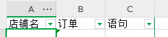
 
 
 
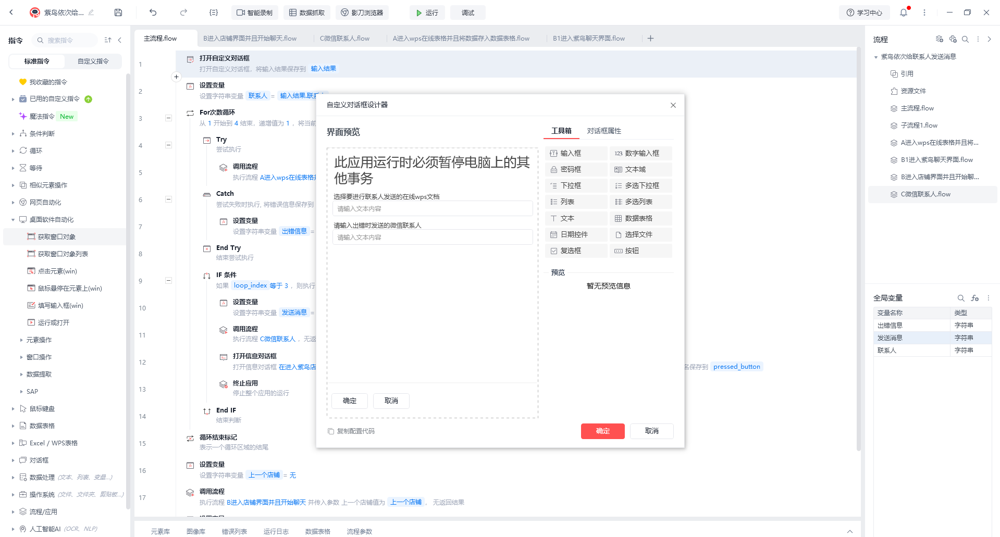
 
 
 
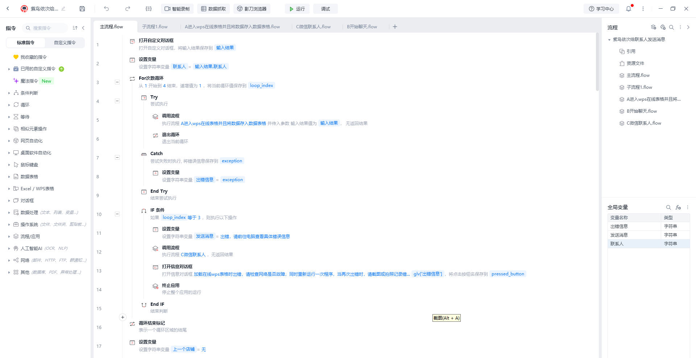
 
 
 
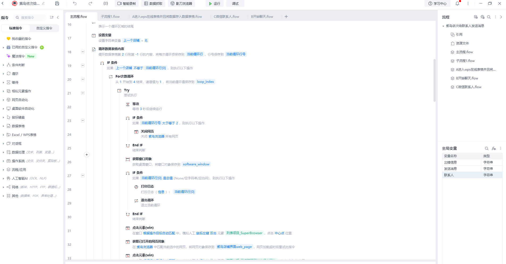
 
 
 
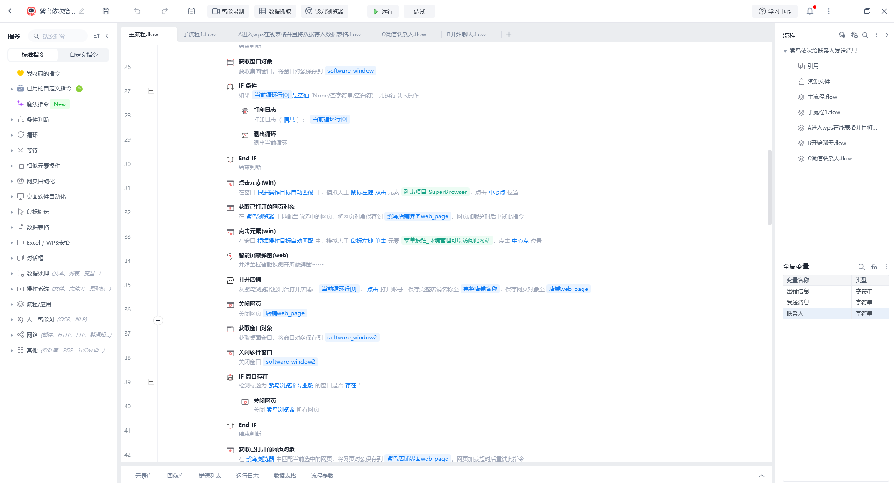
 
 
 
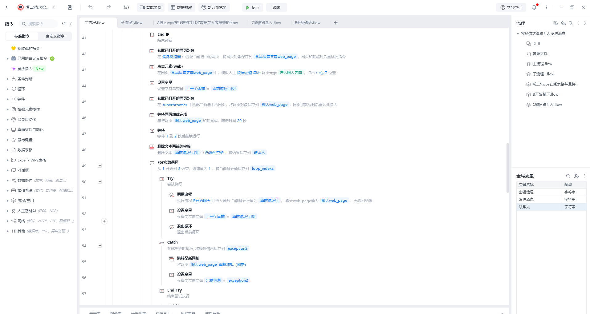

 
 
 

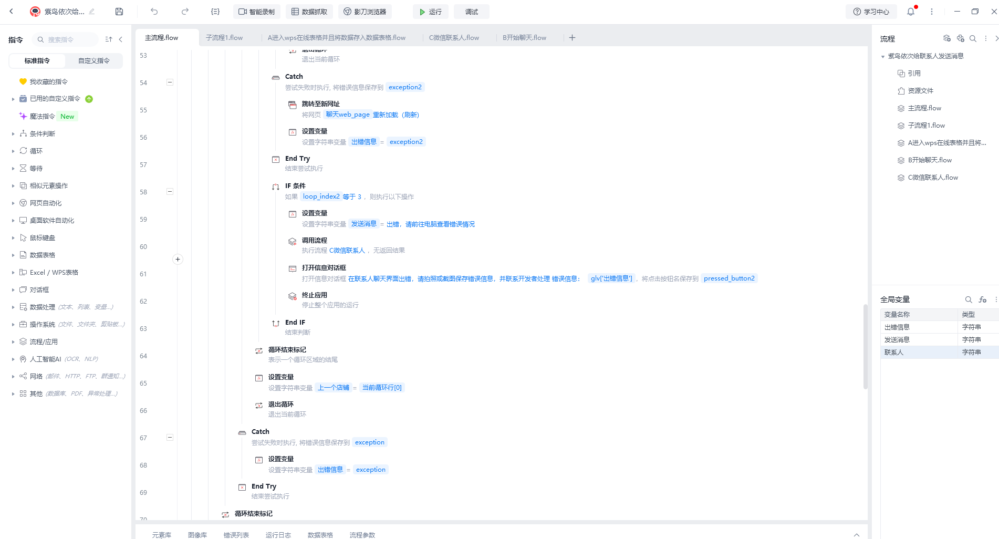

 
 
 

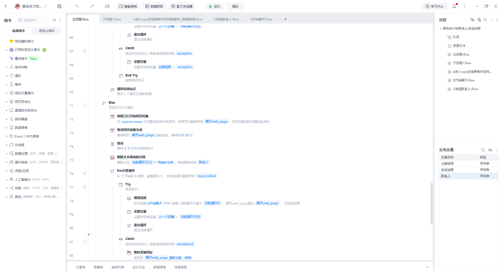
 
 
 
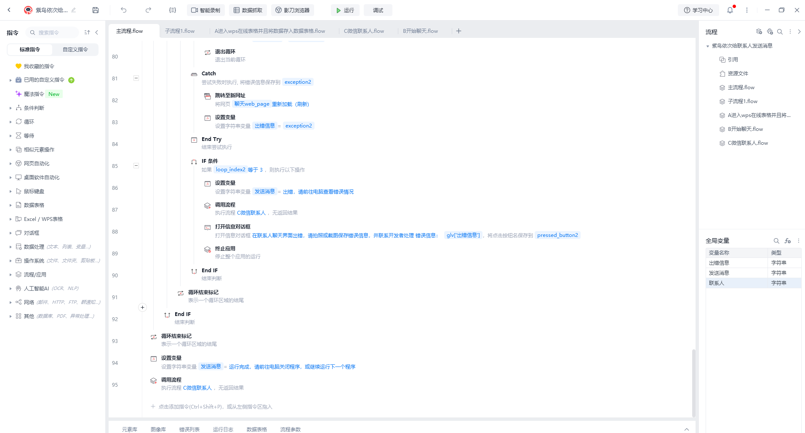

 
 
 
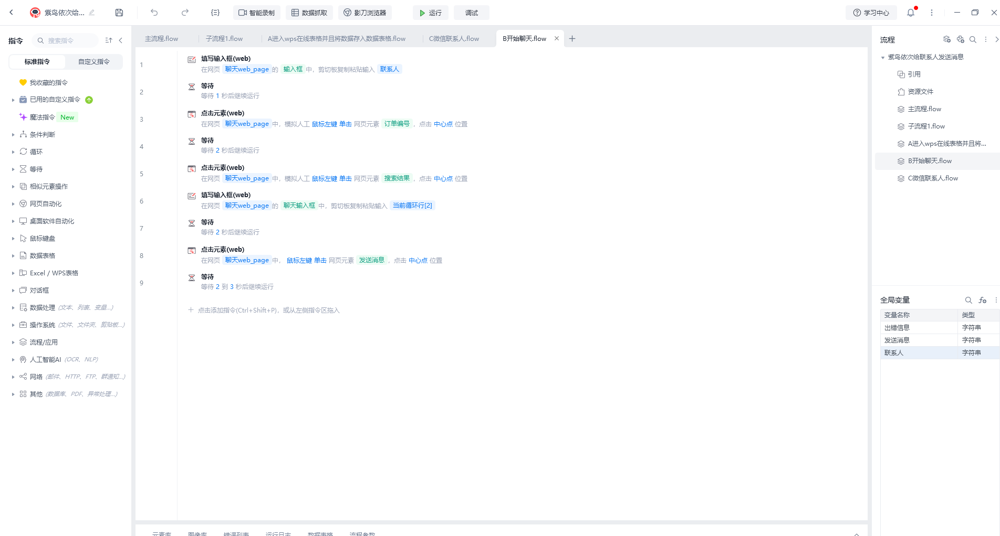
 
 
 
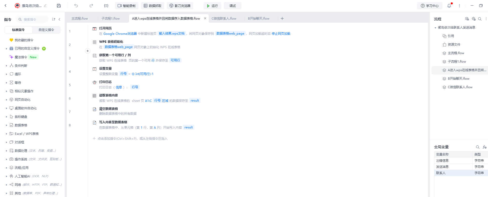
 
 
 
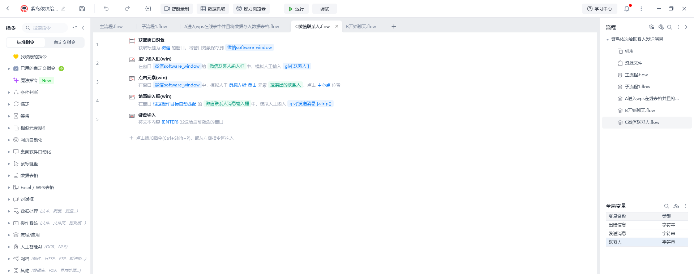
